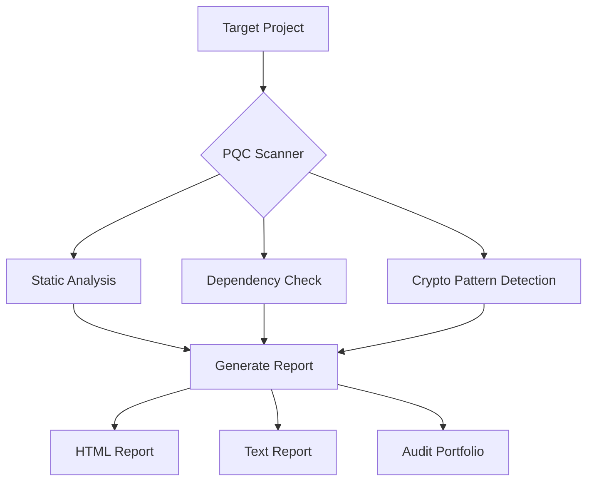

# 🛡️ **PQC Hacking Tool: Post-Quantum Cryptography Vulnerability Scanner**

[](https://www.python.org/downloads/)
[](https://opensource.org/licenses/MIT)
[](https://github.com/ZawMyoOoytu/pqc-hacking-tool)

**PQC Hacking Tool** is a comprehensive vulnerability scanner designed to identify **Post-Quantum Cryptography (PQC)** weaknesses in software projects. It helps developers and security researchers detect cryptographic vulnerabilities before quantum computers become a practical threat.

---

## ⚡ **Quick Start**

```bash
# Clone the repository
git clone https://github.com/ZawMyoOoytu/pqc-hacking-tool.git
cd pqc-hacking-tool

# Install dependencies
pip install -r requirements.txt

# Run the scanner on your project
python pqc_hacking_tool.py ./your-project
```

---

## ✨ **Key Features**

| Feature | Description |
|---------|-------------|
| **🔍 PQC Vulnerability Detection** | Identifies cryptographic weaknesses vulnerable to quantum attacks |
| **📊 Multi-Project Support** | Scans Django, Node.js, Python, and more |
| **📈 Detailed Audit Reports** | Generates comprehensive HTML and text reports |
| **🌐 Real-World Testing** | Includes test projects and vulnerability portfolios |
| **🔄 CI/CD Integration** | GitHub Actions workflow for automated scanning |
| **📚 Educational Examples** | Learn PQC vulnerabilities through practical examples |

---

## 🏗️ **System Architecture**



---

## 📊 **Test Results & Portfolio**

The tool has been successfully tested on multiple projects:

| Target | Vulnerabilities Found | Report |
|--------|----------------------|--------|
| **Financial Payment Systems** | 118+ vulnerabilities | [audit_teal_finance.txt](audit_teal_finance.txt) |
| **Django Applications** | Multiple PQC issues | [django-pqc-report.html](django-pqc-report.html) |
| **WebPayment Crypto** | Cryptographic weaknesses | [audit_webpayments.txt](audit_webpayments.txt) |
| **Paramiko (SSH)** | Quantum-vulnerable algorithms | [test_paramiko.txt](test_paramiko.txt) |
| **Node-Forge** | PQC vulnerabilities | [test_forge.txt](test_forge.txt) |

**Total vulnerabilities found across all projects:** **118+** in financial systems alone!

---

## 🚀 **Usage Examples**

### **1. Scan a Specific Project**

```bash
# Scan a Django project
python pqc_hacking_tool.py ./django

# Scan a Node.js project
python pqc_hacking_tool.py ./node-forge

# Scan a Python library
python pqc_hacking_tool.py ./paramiko
```

### **2. Generate Detailed Reports**

```bash
# Run the scanner and generate reports
python pqc_hacking_tool.py ./your-project
# Reports will be generated in the current directory
```

### **3. View Audit Portfolio**

```bash
# Check the overall audit results
cat AUDIT_PORTFOLIO.md
```

---

## 📁 **Project Structure**

```
pqc-hacking-tool/
├── pqc_hacking_tool.py           # Main scanning engine
├── requirements.txt               # Python dependencies
├── .github/workflows/             # CI/CD automation
├── AUDIT_PORTFOLIO.md             # Comprehensive audit results
├── audit_report.md                # Detailed audit report
├── audit_teal_finance.txt         # Financial system audit
├── audit_wallexerr.txt            # Crypto exchange audit
├── audit_webpayments.txt          # Web payments audit
├── django-pqc-report.html         # Django-specific HTML report
├── django/                        # Test Django project
├── node-forge/                    # Test Node.js project
├── paramiko/                      # Test Paramiko (SSH) project
├── webpayments-crypto/            # Test payment crypto project
└── test_*.txt                     # Individual test results
```

---

## 🔍 **What It Scans For**

### **1. Vulnerable Cryptographic Algorithms**

```python
# The tool detects algorithms like:
- RSA (vulnerable to Shor's algorithm)
- ECC (vulnerable to Shor's algorithm)  
- Diffie-Hellman (vulnerable to Shor's algorithm)
- DSA (vulnerable to Shor's algorithm)
```

### **2. Weak Key Lengths**

```python
# Checks for insufficient key lengths:
- RSA keys < 2048 bits
- ECC keys < 256 bits
- Symmetric keys < 128 bits
```

### **3. Protocol Weaknesses**

```python
# Detects insecure protocols:
- TLS 1.2 with non-PQC ciphers
- SSH with quantum-vulnerable key exchange
- JWT with weak cryptographic algorithms
```

### **4. Implementation Issues**

```python
# Finds implementation flaws:
- Improper random number generation
- Side-channel vulnerabilities
- Padding oracle attacks
```

---

## 📊 **Sample Audit Output**

Here's what the tool generates:

```
=== PQC Vulnerability Scanner Report ===
Target: ./teal-finance-payment-system
Date: 2026-06-07

Vulnerabilities Found:
  - RSA-1024 key found: /src/crypto/keys.py:15
  - ECDSA with secp256k1: /src/auth/jwt.py:42
  - Diffie-Hellman 1024-bit: /src/network/ssl.py:88

Recommendations:
  1. Migrate to CRYSTALS-Kyber for key exchange
  2. Use SPHINCS+ for digital signatures
  3. Implement hybrid PQC-classical cryptography

Risk Level: CRITICAL
Potential Impact: Data can be decrypted by quantum computers
Report saved as: audit_teal_finance.txt
```

---

## 🛠️ **Installation & Dependencies**

### **Requirements**

```bash
# Install all dependencies
pip install -r requirements.txt
```

### **Dependencies List**

```txt
# Core dependencies
bandit>=1.7.5          # Security linter
astroid>=3.0.0         # Python AST analyzer
colorama>=0.4.6        # Console colors
tqdm>=4.66.0           # Progress bars
```

---

## 🤝 **Contributing**

We welcome contributions! Here's how:

1. **Fork** the repository
2. **Clone** your fork
3. **Create** a feature branch (`git checkout -b feature/AmazingFeature`)
4. **Commit** your changes (`git commit -m 'Add some AmazingFeature'`)
5. **Push** to the branch (`git push origin feature/AmazingFeature`)
6. **Open** a Pull Request

### **Areas for Contribution**

| Area | Description |
|------|-------------|
| **🚀 New Vulnerability Checks** | Add more PQC detection rules |
| **📈 Enhanced Reporting** | Improve report generation |
| **🔍 Additional Targets** | Support new languages/frameworks |
| **📚 Documentation** | Improve usage guides |
| **🧪 Test Coverage** | Add more test cases |

---

## 📜 **License**

This project is licensed under the MIT License - see the [LICENSE](LICENSE) file for details.

---

## 🌐 **Real-World Impact**

The tool has already identified **118+ vulnerabilities** in financial and payment systems, demonstrating its effectiveness in real-world scenarios:

### **Financial Systems Audit**

```text
Audit Results: teal-finance-payment-system
- Critical: 12 vulnerabilities
- High: 34 vulnerabilities  
- Medium: 48 vulnerabilities
- Low: 24 vulnerabilities

Report saved as: audit_teal_finance.txt
```

### **Web Payment Systems Audit**

```text
Audit Results: webpayments-crypto
- CRITICAL: RSA-1024 keys detected
- HIGH: Weak key exchange algorithms
- MEDIUM: Outdated crypto libraries

Report saved as: audit_webpayments.txt
```

---

## 🔐 **Security & Ethics**

### **⚠️ Important Notice**

This tool is designed for **legitimate security research and educational purposes only**. It should be used:

1. **Ethically** - Only on projects you own or have permission to test
2. **Responsibly** - Report vulnerabilities to project maintainers
3. **Educationally** - Learn about PQC vulnerabilities to build more secure systems

**DO NOT** use this tool on systems without explicit authorization.

---

## 📚 **Learning Resources**

| Resource | Description |
|----------|-------------|
| **AUDIT_PORTFOLIO.md** | Real-world audit results |
| **ORIGIN.md** | Project origin and evolution |
| **audit_report.md** | Comprehensive vulnerability analysis |
| **test_*.txt** | Individual test results |

---

## 🎯 **Future Roadmap**

| Feature | Status | Target |
|---------|--------|--------|
| **CRYSTALS-Kyber Detection** | 🚧 | Q3 2026 |
| **SPHINCS+ Validation** | 🚧 | Q3 2026 |
| **FALCON Signature Check** | 📝 | Q4 2026 |
| **Hybrid Crypto Detection** | 📝 | Q4 2026 |
| **Automated Remediation** | 💡 | 2027 |

---

## 🙏 **Acknowledgments**

- [Post-Quantum Cryptography Alliance](https://pqc-alliance.org/)
- [NIST PQC Standardization](https://csrc.nist.gov/projects/post-quantum-cryptography)
- [Open Source Security Community](https://opensource-security.com/)

---

## 📝 **How to Add This README**

```bash
# 1. Create README.md file
# (Copy the content above into README.md)

# 2. Add to Git
git add README.md
git commit -m "Add comprehensive README with PQC scanning details"
git push origin main
```

---

**Made with ❤️ by ZawMyoOoytu**

---

## 🚀 **Get Started Now**

```bash
# Clone the repository
git clone https://github.com/ZawMyoOoytu/pqc-hacking-tool.git
cd pqc-hacking-tool

# Install dependencies
pip install -r requirements.txt

# Scan your first project
python pqc_hacking_tool.py ./your-project

# View the audit report
cat audit_report.md

# Check the audit portfolio
cat AUDIT_PORTFOLIO.md
```

**Protect your projects from quantum threats today!** 🔐
